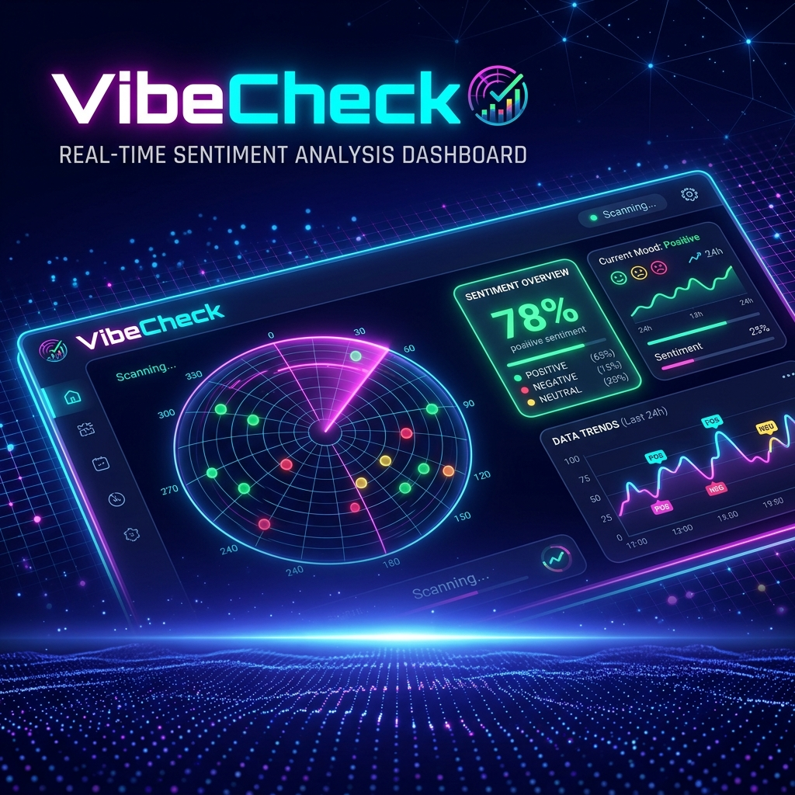
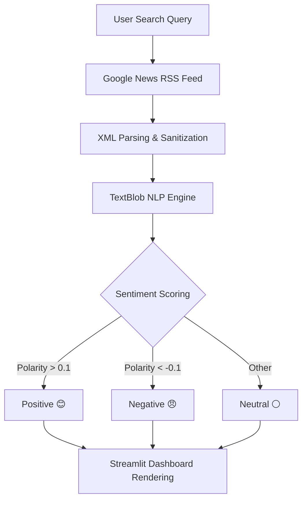

# 🧠 AI Sentiment Radar — VibeCheck



[](https://www.python.org/)
[](https://streamlit.io/)
[](https://opensource.org/licenses/MIT)
[](https://textblob.readthedocs.io/)

**VibeCheck** is a high-performance NLP dashboard that quantifies the global sentiment landscape. By scanning real-time Google News headlines and processing them through advanced sentiment analysis, it offers a real-time "radar" into public perception, media bias, and emerging trends.

---

## 🌐 Live Showcase

Want to see VibeCheck in action? Experience the interactive UI here:  
👉 **[headline-meter-pro.lovable.app](https://headline-meter-pro.lovable.app/)**

---

## ⚡ Features

*   **🔍 Precision Search** – Deep scan any topic: from "Bitcoin" and "Narendra Modi" to "AI Policy" and "Global Markets."
*   **📡 Real-Time Data** – Direct integration with Google News RSS feeds for the latest discourse.
*   **🧠 Neural Sentiment Analysis** – Powered by **TextBlob** to extract:
    *   **Polarity**: Measures the emotional tone (from highly negative to highly positive).
    *   **Subjectivity**: Distinguishes between factual reporting and opinion-heavy editorials.
*   **📊 Immersive Visualizations**:
    *   **Sentiment Donut**: A high-level view of current media tone.
    *   **Polarity Spectrum**: A vertical bar chart showing the "heat" of individual headlines.
    *   **Interactive Vibe-Meter**: Glassmorphic UI elements for granular article data.
*   **🎨 Premium Dark Interface** – A state-of-the-art UI with micro-animations, neon gradients, and Inter typography.

---

## ⚙️ How It Works

The VibeCheck pipeline is engineered for speed and clarity:



---

## 🚀 Installation & Setup

### 1. Requirements
Ensure you have Python 3.10+ installed.

### 2. Quick Install
```bash
git clone https://github.com/abhinandanrai3712-logs/vibecheck-sentiment-radar.git
cd vibecheck-sentiment-radar
pip install -r requirements.txt
```

### 3. Initialize NLP Models
A one-time download is required for the TextBlob corpora:
```bash
python -m textblob.download_corpora
```

### 4. Launch the Radar
```bash
streamlit run app.py
```

---

## 🛠️ Technical Implementation

| Component | Responsibility |
| :--- | :--- |
| **Frontend** | Streamlit (Custom CSS & Python Logic) |
| **NLP Engine** | TextBlob (Averaged Perceptron Tagger) |
| **Data Source** | Google News RSS (v2.0) |
| **Visualization** | Matplotlib (Seaborn-inspired palettes) |
| **UX Design** | Inter Weights + Glassmorphism Tokens |

---

## 💡 Example Analysis

| Topic | Expected Vibe | Rationale |
| :--- | :--- | :--- |
| **Bitcoin** | **Highly Volatile** | Markets swing between extreme bullishness and regulatory FUD. |
| **Climate Change** | **Objective/Negative** | Frequent fact-based reporting on environmental challenges. |
| **Space Exploration**| **Highly Positive** | Discovery-focused news usually attracts positive polarity scores. |

---

## 📄 License

This project is licensed under the MIT License - see the [LICENSE](LICENSE) file for details.

---
*Built with ❤️ by Antigravity*